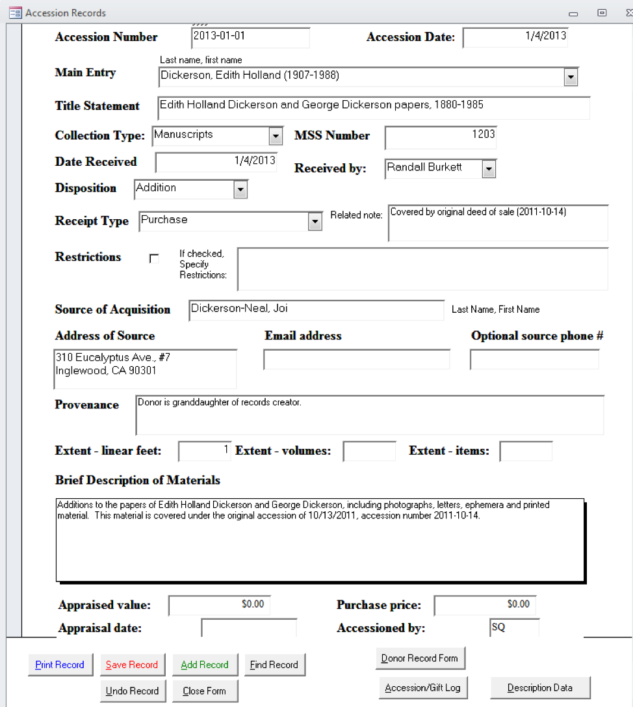
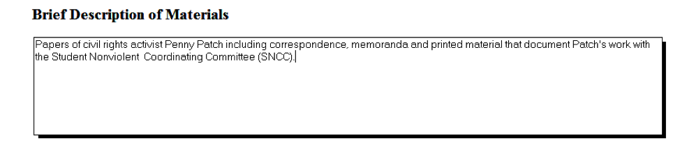
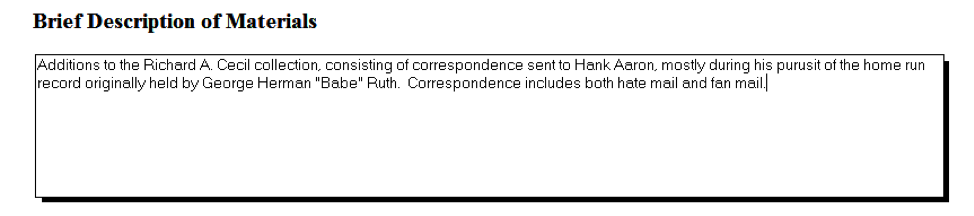

.. _Accessioning-and-precustodial-work:

==================================
Accessioning and Precustodial Work
==================================

Precustodial work is all work that occurs before a collection is formally transferred 
to the Rose Library. It includes the packing, shipping, and receiving of material, as 
well as managing the paperwork required to formally transfer a collection or item. 
Collection Services staff should be prepared to work with donors, vendors, and 
curators to provide guidance on any precustodial actions taken by the Library. 

.. _Consultation-with-donors:

-----------------------------
1.1 Consultations with donors
-----------------------------

Prior to a collection being acquired by the Rose Library, The Head of Collection 
Services may consult with curators to draft an `Operational Impact Statement 
<https://emory.box.com/s/btfvoh8gltpob8ynj8uhe3r7348pr455>`_ to assess the overall 
space and supply needs of a collection, as well as cost of transfer, accessioning, 
processing, and storing a collection.  

Additionally, collection services staff may meet with donors or curators to provide 
guidance and assistance on matters such as: 

*	Packing and shipping
*	Transfer of of born-digital material (see forms and procedures `here 	
	<https://emory.box.com/s/ykvtm447e8e3b92gb7kvmqe84o3xugtf>`_) 
*	Appraisal
*	Arrangement and description
*	Conservation

.. _Collections-receiving:

--------------------------
1.2 Collections receiving 
--------------------------

Collections receiving is the physical transfer of collection material from a donor, 
individual seller, or vendor to the Stuart A. Rose Manuscript, Archives, & Rare Book 
Library. The primary point of contact for collections receiving for Emory University 
Archives at the Rose Library is the University Archivist. The primary point of 
contact for collections receiving for all other units at the Rose Library is the 
Accessioning & Collections Manager.

.. _Receipt-of-new-or-potential-acquisitions:

^^^^^^^^^^^^^^^^^^^^^^^^^^^^^^^^^^^^^^^^^^^^^^^
1.2.4 Receipt of New or Potential Acquisitions 
^^^^^^^^^^^^^^^^^^^^^^^^^^^^^^^^^^^^^^^^^^^^^^^

All collection material should be received and opened/unpacked by the Accessioning 
and Collections Manager. 

Small packages will be delivered to the Rose Library mailroom.  Larger packages or 
collections will be delivered to the main Woodruff mailroom.  The main Woodruff 
mailroom on Level 2 is not a secure space and collection material should be moved to 
a secure holdings location as soon as possible upon arrival. 

**New Acquisition Storage:**

Acquisitions that measure 10 linear feet or fewer will be unpacked and stored on the 
new acquisition storage shelves on Level 9, given space. Larger acquisitions will be 
moved to additional holding spaces on Level 9 or 11. Hard drives storing born digital 
collection material should be securely stored in the Digital Archives lab while 
awaiting accessioning. In some circumstances, material may be received at the Library 
Service Center (LSC).  All new acquisitions should be labelled with the collection 
title, date of receipt, and temporary box number upon receipt.  The Accessioning and 
Collections Manager will log all new acquisitions in the pending acquisitions tab on 
the Master Shelf List. 

Upon receipt of a collection the Accessioning and Collections Manager will:  

*	Open and unpack the collection
*	Add material to either the `Gift or Purchase Acquisitions Log 
	<https://emory.app.box.com/folder/2493112313>`_ as appropriate
*	Place the items and any accompanying documentation onto the appropriate shelf for 
	curatorial review 
*	Alert the Curator that material is ready to be reviewed (Curator will make final 
	decision on whether to move forward with the acquisition)
	
If the curator decides to not move forward with an acquisition, it is the curator's 
responsibility to notify the donor/seller. The Accessioning and Collections Manager 
can help coordinate return of the material, once the donor/seller has been notified 
by the curator. 

.. _Paperwork:

^^^^^^^^^^^^^^^^
1.2.5 Paperwork
^^^^^^^^^^^^^^^^

No collection material may be cataloged or accessioned until the appropriate 
paperwork has been received. All paperwork should be transferred to the Accessioning 
and Collections Manager.  

**Managing Paperwork in Box**

Rose staff stores and manages all acquisitions-related paperwork on Box.  Box allows 
staff to access shared folders and communicate with one another inside the 
application, creating and maintaining a record of communications for each 
acquisition.  

There are two Box folders that we use to manage this process-the Rose Library 
Purchase Payments folder and the Rose Library Gift in Kind process folder.  Each of 
these folders is subdivided by step in the acquisition process and then by major 
collecting area.  As new collections move through the acquisitions process, the 
Accessioning and Collections Manager will update the files and move the paperwork 
into a folder associated with the next stage of the process.  As paperwork moves 
through the process, the Accessioning and Collections Manager will use the tagging 
and task list functions in Box to update Rose Library and LITS staff members about 
the status of the acquisition or to alert someone when an action is required. 

**Paperwork Required for Purchase Payment**

The Rose Library requires the following forms for purchases: 

*	Invoice (Collections Manager will generate an invoice to accompany a Deed of Sale)
*	Payment Request Form (PRF)
*	Deed of Sale (for purchases from private individuals)
*	Domestic Vendors: Supplier/Individual Information Form (SIIF) and an ACH Payment 
	Authorization Form (ACH)
*	International Vendors: W-8BEN-E (businesses)/W-8BEN (individuals) and Foreign 
	Wire Transfer Form
*	Vendor Forms are required when: 

	*	The seller is new
	*	The Rose Library has not purchased from the seller within the last 14 months
	*	The seller's information (including address) has changed since we last 
		purchased material from them
		
**Managing Purchase Paperwork in Box**

The Rose Library manages purchase paperwork on Box through the Rose Library Purchases 
Payments Folder.  This folder is organized into subfolders by process step and then 
by collecting area.   

*	**Step 1:** Received and Pending
	
	*	Curators or Accessioning and Collection Manager upload preliminary paperwork 
		for prospective acquisitions such as invoices, One-Pagers, or Appraisal 
		reports to this folder.    
	*	Accessioning and Collection Manager either confirms that a seller is an 
		active vendor with the University or new vendors and sellers to obtain vendor 
		paperwork. 
	*	Accessioning and Collection Manager confirms that all required paperwork has 
		been submitted and combines the vital documents into one file.  Vital 
		documents include the invoice, the Deed of Sale, vendor documents, if 
		applicable, and the PRF. 
	*	File titles should be structured to include the vendor name, invoice number 
		and fiscal year. For example: "Vendor or Seller Name_Invoice Number_Fiscal 
		Year," such as "John Doe Bookseller_123456_FY17." 
	*	Once all paperwork is submitted, the file moves to step 2.
	
*	**Step 2:** Submitted PRFs
	
	*	Accessioning and Collection Manager tags the Associate Director and Director 
		to approve the disbursement of funds.  
	*	Director or Associate Director will approve in the Box comment section.
	*	Once the purchase has been approved, the file moves to step 3.
	
*	**Step 3:** Verified

	*	The Accessioning and Collections Manager tags the Administrative Assistant 
		for submission to ServiceNow.
	*	The Administrative Assistant submits the paperwork for payment via ServiceNow.
	*	The Administrative Assistant leaves a Box comment indicating the submission 
		of the payment along with the REQ number associated with the ServiceNow 
		request.
	*	Once the paperwork has been submitted to ServiceNow: 
		
		*	The Accessioning and Collection Manager tags the Budget Analyst and the 
			Senior Accounting Assistant in LITS Finance to alert them for their 
			tracking purposes.
		*	The Accessioning and Collections Manager tags the accessioning team on 
			purchases including manuscript material to alert them that the material 
			can now be accessioned. 
			
At the end of each fiscal year, the Accessioning and Collections Manager moves all 
completed paperwork in the Step 3 folder for purchases into a new subfolder titled 
"FY--" (e.g., FY16).

**Paperwork Required for Gifts in Kind**

The following paperwork is required to process and accession gifts: 

*	Signed Gift in Kind Form (required for all gifts)
*	Deed of Gift (required for manuscript collections that a donor or appraiser 
	values over $5000, or collections with any terms, conditions, or restrictions 
	imposed by the donor)
	
**NOTE:** For gifts containing only books, the Rose Library only requires a Gift-in-Kind 
Contribution Form in order to proceed with cataloging, but Emory's department of 
Development and Alumni Relations (DAR) may require additional paperwork and an 
appraisal, depending on the value that the donor places on the gift. In this case it 
is DAR's responsibility to pursue documentation beyond the Gift in Kind form.

**Managing Gift Paperwork in Box**

The Rose Library manages gift paperwork on Box through the Rose Library Gift in Kind 
Process folder. This folder is organized into subfolders by process step and then by 
collecting area.  The Accessioning and Collections Manager is responsible for 
combining paperwork into a single PDF file, moving that file between the Box folders, 
and tagging appropriate parties for next steps.

*	**Step 1:** Gifts Received by Collections Manager 

	*	Curators or Accessioning and Collections Manager upload preliminary paperwork 
		for prospective acquisitions.  This could include one pagers, appraisal 
		reports, or Box Notes detailing conversations and negotiations with donors. 
	*	Curators are responsible for procuring the appropriate paperwork from donors.
	*	All files should follow the naming convention:  "Donor Name_Calendar Year 
		Received," such as "John Doe_2016."
	*	Once an acquisition has a completed Gift in Kind form, and, if necessary, a 
		Deed of Gift, the Accessioning and Collections Manager moves the paperwork to 
		the *Gifts Ready for Acknowledgement by Rose Director* folder.
		
*	**Step 2:** Gifts Ready for Acknowledgement by Rose Director

	*	The Accessioning and Collections Manager notifies the Administrative 
		Assistant with a Box tag.
	*	The Administrative Assistant drafts an acknowledgement letter and facilitates 
		getting it signed by the Director.
	*	The Administrative Assistant sends the acknowledgement letter and leaves a 
		note in Box with this information. 
	*	At that point, the Accessioning and Collections Manager moves the 
		documentation to *Gifts Ready for DAR Acknowledgement* folder.
		
*	**Step 3:** Gifts Ready for DAR Acknowledgment

	*	The Accessioning and Collections Manager tags the Director and Assistant 
		Director of Development for the Libraries on Box.
	*	DAR will acknowledge the gift and file a copy of the Gift in Kind in their 
		records.
		
At the end of the calendar year, the Accessioning and Collections Manager moves all 
completed paperwork in the Step 3 folder for gifts into a new subfolder for the 
calendar year.

Unsolicited gifts are documented in the Step 1: Gifts Received by Collections 
Manager, usually with a Boxnote, but may be represented with a letter, or other 
documentation from the donor. When creating a Boxnote for an unsolicited gift, 
include contact information for the donor, the contents of the gift, the physical 
size of the gift, and the date of arrival. The Administrative Assistant is 
responsible for  following up with the donor to obtain proper paperwork. 

.. _Financial-appraisal:

^^^^^^^^^^^^^^^^^^^^^^^^^^
1.2.6 Financial Appraisal
^^^^^^^^^^^^^^^^^^^^^^^^^^

Collections may be appraised in two circumstances, if a donor would like to take a 
tax write off on a gift or if curators need a professional evaluation to determine a 
fair purchase price for a prospective acquisition.   It is the donor's responsibility 
to arrange appraisals for tax purposes.

Collection Services staff may occasionally be called on to assist in coordinating and 
facilitating financial appraisals of Rose Library collections or potential 
acquisitions.  While we can facilitate the work of professional appraisers, Rose 
Library staff cannot provide or estimate a value for any special collections material 
per the `ACRL Code of Ethics for Special Collections Librarians 
<http://rbms.info/standards/code_of_ethics/>`_, nor can we provide any tax advice to 
donors.  

If a curator or administrator chooses to engage an appraiser, they must schedule the 
appointment with the appraiser and contact the Accessioning and Collections Manager 
or Head of Collection Services as early as possible.

Once an appraisal is scheduled, the Accessioning and Collections Manager will: 

*	Reserve the Folio Room for the appointment  
*	Notify Research Services staff
*	Move the material to the Collections Transition Room (CTR) in advance of the visit
*	Return material to its holding location when the appraisal is concluded

Invoices for an appraiser's services should be directed to the Administrative 
Assistant. Appraisal reports prepared for collection material we are acquiring should 
be provided to the Accessioning and Collections Manager, who will post them to Box 
for everyone's access. 

**NOTE:** this is the only instance when unaccessioned and uncataloged material 
should be stored in the CTR and/or made available in the Reading Room. Collection 
Services is not responsible for assisting the appraiser with any billing or travel 
issues; those inquiries should be directed to the Rose Administrative Assistant.

.. _Accessioning:

-----------------
1.3 Accessioning
-----------------

Accessioning is the formal act of taking legal and physical control of an archival or 
manuscript collection. Formally accessioning material helps to establish the 
authenticity of the material through documenting chain of custody. It also gives the 
Rose Library administrative and custodial control over collections and shows that the 
library is acting in good faith when accepting archival material by documenting the 
transfer and its terms. 

The Rose Library aims to make all new acquisitions available to researchers 
immediately following accessioning. Therefore, accessioning new material requires 
sufficient description to make the collection discoverable and usable. Material must 
be described at minimum at the box level, but other descriptive information may be 
limited. Detailed processing is not common at this time, though may be warranted 
(e.g. the collection is quite small, researcher need is high). 

Determine the appropriate :ref:`level of processing<>` at the time of accessioning 
and then move forward with creating the descriptive documents.

.. _Managing-accessioning-workflow:

^^^^^^^^^^^^^^^^^^^^^^^^^^^^^^^^^^^^^
1.3.1 Managing Accessioning Workflow
^^^^^^^^^^^^^^^^^^^^^^^^^^^^^^^^^^^^^

When material has been either acknowledged or paid for and is ready to be accessioned 
the Accessioning and Collections Manager will share this information with the 
accessioning team. 

*	When new acquisitions are ready to be accessioned, the Accessioning and 
	Collections Manager tags the accessioning team in Box.
*	The Accessioning and Collections Manager maintains a whiteboard with all new 
	manuscript acquisitions and marks the ones that are ready for discussion at the 
	weekly accessioning meeting.
*	During this meeting, the Accessioning and Collections Manager updates the team on 
	the status of pending collections and gives information on any significant, new 
	collections that have entered the acquisitions process.
*	The accessioning team members add collections to their individual accessioning 
	queues based on current workloads and specific expertise.
*	The Accessioning and Collections Manager distributes original paperwork for the 
	new assignments.

.. _Creation-of-the-accession-record:

^^^^^^^^^^^^^^^^^^^^^^^^^^^^^^^^^^^^^^^
1.3.2 Creation of the Accession Record
^^^^^^^^^^^^^^^^^^^^^^^^^^^^^^^^^^^^^^^

The system of record for accession information is the Accessions Database located on 
the F: Drive at  ``F:/MARBL/Accession Database/Manuscript Accessions.mbd``.  All new 
collection material receives a record in this database upon receipt. 

**Navigating the Database and Using Microsoft Access**

To create the accession record, from the main menu of the accession database select 
"Edit Existing Records." At the next menu choose "Edit Accession Records." This will 
open the database to the first record. At the bottom of the page, click the double 
arrow, which will progress the database to the last record. Make note of the 
accession number on the last record.

To add a new record, click "Add Record" at the bottom of the page, and a blank form 
will open. 

**Populating the Accesssion Record**

Below is a sample record in the accessions database.  The record should be as fully 
fleshed out as you are able to make it with the information available to you.  Not 
all fields are required for each new accession, but it is the intent to capture as 
much information about the collection and its transfer as you can at this stage. 

**How to complete the accession record:**

+---------------------+--------------------------------------------------------------+
|*Accession Number:*  |	All collection material acquired by the Rose Library is      |
|                     | assigned a unique accession number, consisting of the year,  |
|                     | the month, and the next accession number in sequence         |
|                     | for the month [e.g., 2017-06-34].  To determine which number |
|                     | to use, arrow back to the previous accession record.         |
+---------------------+--------------------------------------------------------------+
|*Accession Date:*    | This field will pre-populate with the current date.          |
+---------------------+--------------------------------------------------------------+
|*Main Entry:*	      |	Determine if the collection is a new acquisition or an       |
|                     |	addition to an existing collection.                          |
|                     |                                                              |
|                     | If the material is being added to an existing collection, the|
|                     | accession database will automatically fill in the title      |
|                     | statement and manuscript number when you begin to type in    |
|                     | the main entry.                                              |
|                     |                                                              |
|                     | If you are establishing a new collection, follow [THESE      |
|                     | RULES].                                                      |
+---------------------+--------------------------------------------------------------+
|*Title Statement:*.  | Assign a DACS compliant title to the collection by following |
|                     |	[THESE RULES].                                               |
+---------------------+--------------------------------------------------------------+
|*Collection Type:*   | Choose "Manuscripts" from the dropdown menu.                 |
+---------------------+--------------------------------------------------------------+
|*Manuscript Number:* |	A manuscript collection number is prefixed by MSS and        | 
|                     |	followed by a sequential number e.g., MSS 1301.              |
|                     |                                                              |
|                     | If the accession is an addition to an existing collection,   |
|                     | the manuscript number field will populate automatically when |
|                     | you select the appropriate main entry or title statement.    |
|                     |                                                              |
|                     | If you are establishing a collection, consult the Manuscript |
|                     | Register housed on Box (link) to determine the next available|
|                     | manuscript collection number. Once the manuscript number is  |
|                     | assigned and entered into the database, add the new.         |
|                     | manuscript number, title statement, and acquisition date to  |
|                     | the Manuscript Register on Box.                              |
+---------------------+--------------------------------------------------------------+						
|*Date Recieved:*.    |	This field auto-populates with the current date.             |
+---------------------+--------------------------------------------------------------+
|*Received By:*.      | Fill in this field with the name of the curator or staff     |
|                     | person responsible for bringing in the collection. You can   |
|                     | either type a name into this box, or there are some          |
|                     | pre-populated names you can select from the menu.            |
+---------------------+--------------------------------------------------------------+	
|*Disposition:*       | Choose either "Addition" or "Establish Collection" from the  |
|                     | drop-down menu.                                              |
+---------------------+--------------------------------------------------------------+
|*Receipt Type:*      | Choose either "Gift," "Purchase," "University Archives       |
|                     | Transfer," "Deposit," or "Other" from the drop-down list. In |
|                     | the majority of cases the acquisition is either a gift or a  |
|                     | purchase.                                                    |
+---------------------+--------------------------------------------------------------+
|*Related Note:*.     | The Related note field next to Receipt type field is used to | 
|                     | note special information about the material, for example that| 
|                     | the acquisition is covered by a previous deed of gift or that| 
|                     | the value of items purchased in foreign currency has been    |
|                     | converted to dollars.                                        |
|                     |                                                              |
|                     | For example:                                                 |
|                     |                                                              |
|                     | *   "Original price of £17,425 converted to American         |
|                     |     dollars."                                                |
|                     | *   "No new paperwork. Covered under original deed of        |
|                     |     gift/sale."                                              |
+---------------------+--------------------------------------------------------------+
|*Restrictions:*      | Note any restrictions stipulated by the deed of gift or sale |
|                     | in this field. There is a character limit on this field, so  |
|                     | if there is restriction information that cannot be contained |
|                     | in this field use this field to refer readers to the "Brief  |
|                     | Description of Material" field and record restriction        |
|                     | information there.                                           |
+---------------------+--------------------------------------------------------------+
|*Source of           | Record the immediate source of acquisition here.  This is    |
|Acquisition:*        | generally the name of a donor or a rare book and manuscript  |
|                     | dealer and can be found on invoices, deeds, and other        |
|                     | acquisition paperwork.                                       |
+---------------------+--------------------------------------------------------------+
|*Address/Email       | Populate these fields with the contact information for the   |
|Address/Phone Number |	Source of Acquisition.  The address field is required, and   |
|of Source:*          | the record will not save if this field is blank.  If you do  |
|                     | not have an address for the source of the collection you     |
|                     | should enter "address unknown."  Email and phone number      |
|                     | should be filled out if the information is known.            |
+---------------------+--------------------------------------------------------------+
|*Provenance:*        | In the Provenance field, explain the relationship of the     |
|                     | donor to the creator of the records. For example, "Donor is  |
|                     | creator of records," or "Donor is executor of creator's      |
|                     | estate."  For collections that are purchased from a dealer   |
|                     | with no other known provenance or custodial history          |
|                     | information record that the collection was "Purchased from   |
|                     | dealer; provenance unknown."                                 |
|                     |                                                              |
|                     | If you have additional information about how the records     | 
|                     | changed hands over time it should be recorded here. For      |
|                     | additional guidance on recording provenance [SEE HERE]       |     
+---------------------+--------------------------------------------------------------+
|*Extent:*            | Record the extent of the material, using linear footage when |
|                     | possible. Many new accessions will be single items added to  |
|                     | existing collections, in which case number of items can be   |
|                     | used for extent.                                             |
+---------------------+--------------------------------------------------------------+
|*Brief Description   |	The Brief Description of Materials field should include a of | 
|Materials:*          | description of the creator and a clear description of the    |
|                     | materials. Specific language is used in this field to        |
|                     | indicate whether the acquisition is a new collection or an   |
|                     | addition to an existing collection.                          |
|                     |                                                              |
|                     | See :ref:`figure 2<figure2>` and                             | 
|                     | :ref:`figure 3<figure3>`                                     |
|                     |                                                              |
|                     | In some cases an addition to a collection will come from a   |
|                     | different source or have a different provenance than the     |
|                     | original materials.  In these cases it is particularly       |
|                     | important that we be able to track which items came from     |
|                     | which sources.  In miscellany collections or instances where |
|                     | the addition is very small (a few files), write the accession|
|                     | number on the folder and integrate the folders into the      |
|                     | collection and note the Box and Folder number in the Brief   |
|                     | Description of Materials field.                              |
|                     |                                                              |
|                     | For large additions, note the box numbers in the field and   |
|                     | add the new custodial history information to the note in the |
|                     | finding aid [LINK].                                          |
+---------------------+--------------------------------------------------------------+
|*Appraised Value/    | If a collection has been financially appraised or the donor  |
|Appraisal Date:*     | has filled out the "Value" line on the Gift in Kind form     |
|                     | record that information in this field along with the date of |
|                     | the appraisal or GIK. If a collection has been appraised and |
|                     | is then purchased by the Rose Library do not include the     |
|                     | appraised value in this field, you will record the actual    |
|                     | purchase price in the Purchase Price field.                  |
+---------------------+--------------------------------------------------------------+
|*Purchase Price:*    | Record the purchase price of the item(s) or collection.  If  |
|                     | the invoice reflects an international currency, convert to   |
|                     | dollars and include the original purchase price in the       |
|                     | Related Notes field.                                         |
+---------------------+--------------------------------------------------------------+
|*Accessioned By:*    | Add your initials.                                           |
+---------------------+--------------------------------------------------------------+

.. _figure2:

Figure 2: Example of the Brief Description of Materials field to indicate the 
establishment of a new collection.

.. _figure3:

Figure 3: Example of the Brief Description of Materials field to indicate the 
addition to an established collection.

**Finalizing the Record**

When you have finished filling out the record, press the Save Record button. Use the 
Print Record button to print at least two copies of the record, one for the 
collection file and one for the accession files.

If you assigned a new manuscript number, press the Description Data button, then 
click Fill Data, then Save. This creates an entry in the database's Manuscript 
Register.

.. _Accessioning-digital-objects:

^^^^^^^^^^^^^^^^^^^^^^^^^^^^^^^^^^
1.3.4 Accessioning Digital Objects
^^^^^^^^^^^^^^^^^^^^^^^^^^^^^^^^^^

In order to ensure consistency across accession records, archivists should use the 
:ref:`digital archives controlled vocabulary<Digital-archives-controlled-vocabulary>` 
to describe digital objects.

Typically, if we receive laptops or personal computers, we will only retain the 
internal hard drive following processing. The Digital Archivist will send all other 
hardware and casings to surplus. You should therefore describe laptops and computers 
as "hard drives" in accession records (see the digital archives controlled vocabulary 
below). If we do have reason to keep the entire computer (either because they feature 
labels and markings intentionally added by the donor/creator that contribute 
significant meaning or because the entire computer will be required in order to 
access and transfer files), describe these as either "laptop computers" or 
"microcomputers." Consult with the digital archivist if you are unsure of which term 
to use.

Apart from exceptional cases, you should not accession computer peripherals 
(monitors, keyboards, etc.), networking hardware (routers, for example), and other 
electronic components not used to store data unless:

*	They feature labels and markings intentionally added by the donor/creator that 
	contribute significant meaning to the collection. These should not be labels or 
	markings that simply denote ownership or give instruction on use or function 
	(e.g., "Dorothy's mouse" or "plug in here").
*	In cases where the associated hardware is particularly old or obscure and it has 
	been deemed likely, following consultation with a digital archivist, that this 
	equipment will be required in order to access and transfer digital files from the 
	associated hardware.
	
If you have questions about whether a digital object should be accessioned, consult 
the digital archivist.

**Accessioning Workflows**

Like all collection material, born digital media and files should not be accessioned 
until paperwork has been completed. The workflow will vary slightly depending on the 
method of transfer or if the born digital material is part of a hybrid collection.  

If a hybrid collection includes known born digital media and/or hardware:

*	During the weekly accessioning meeting, the Accessioning and Collections Manager 
	assigns hybrid collection to a member of the accessioning team. 
*	The accessioning archivist adds information regarding any known born-digital 
	media and/or hardware to the born-digital inventory, which is stored as a tab in 
	the master shelf list.
*	The accessioning archivist accessions the born-digital media and/or hardware with 
	the rest of the collection, using the digital archives controlled vocabulary 
	(listed below) to describe what is included.
*	Archivists should keep smaller pieces of born-digital media such as floppy disks 
	or flash drives with the collection when moved to the stacks. The Digital 
	Archivist and Accessioning and Collections Manager will identify a storage 
	location for computer towers and laptops.  The accessioning team member will 
	shelve the computer and record the location in the born-digital inventory and the 
	master shelf list.
*	If it is a small amount of born digital material (i.e., less than 50 floppy 
	disks), the accessioning archivist should create the disk images for the 
	collection. This decision can be made in consultation with the digital 
	archivist.
	
If a collection (or addition to a collection) is comprised exclusively of 
born-digital media and/or hardware:

*	The Accessioning and Collections Manager notifies and assigns accessioning 
	responsibilities to the Digital Archivist. Born digital media and/or hardware is 
	temporarily stored in the accessioning area until retrieved by the digital 
	archivist for accessioning.
*	The digital archivist accessions the born-digital media and/or hardware, using 
	the :ref:`digital archives controlled 
	vocabulary<Digital-archives-controlled-vocabulary>` to describe what is included.
*	Where possible, the digital archivist will image disks and ingest disk images 
	into the digital repository at the point of accessioning.
*	The digital archivist adds information about the file transfer to the 
	born-digital inventory, which is stored as a tab in the master shelf list. The 
	archivist should also note whether they have ingested the material into the 
	digital repository.
*	The digital archivist creates BD box(es) for accessioned media, including hard 
	drives removed from laptops and computer towers.  If it is not possible to remove 
	a hard drive from its casing, the location of the hardware will be recorded on 
	the master shelf list and the born digital inventory.
	
**NOTE:** If imaging is completed at the time of accessioning, born-digital media and 
hardware can be transferred immediately to the LSC. 

If a hybrid collection includes a file transfer:

*	The receiving digital archivist notifies the Accessioning and Collections Manager 
	that a file transfer has been received.
*	The receiving digital archivist moves the transferred files to a temporary 
	storage location on the digital archive lab's local hard drives. Due to 
	preservation concerns, the digital archivist may ingest transferred files into 
	the digital repository prior to the completion of accessioning.
*	During the weekly accessioning meeting, the Accessioning and Collections Manager 
	assigns hybrid collection to a member of the accessioning team. 
*	The accessioning archivist adds information about the file transfer to the born 
	digital inventory, and notes whether they have ingested the files into the 
	digital repository.
*	The accessioning archivist accessions the file transfer with the rest of the 
	collection, using the term "Digital files" taken from the :ref:`digital archives 
	controlled vocabulary<Digital-archives-controlled-vocabulary>` to describe what 
	is included.
	
If a collection (or addition to a collection) is comprised exclusively of a file transfer:

*	The receiving digital archivist notifies the Accessioning and Collections Manager 
	that a file transfer has been received.
*	During the weekly accessioning meeting, the Accessioning and Collections Manager 
	assigns the collection to a digital archivist. 
*	The digital archivist accessions the file transfer, using the term "Digital 
	files" taken from the :ref:`digital archives 
	controlled vocabulary<Digital-archives-controlled-vocabulary>` to describe 
	what is included.
*	The digital archivist ingests the transferred files into the digital repository.
*	The digital archivist adds information about the file transfer to the 
	born-digital inventory, and notes that files have been ingested into the digital 
	repository.
	
.. _Digital-archives-controlled-vocabulary:

+-----------------------------------------------------------------------------------+
| **Digital Archives Controlled Vocabulary**                                        |
+===================================================================================+
| Compact disc     | Describes CDs (all types)                                      |
+------------------+----------------------------------------------------------------+
| Digital files    | Describes files received via file transfer, as opposed to      |
|                  | original media                                                 |
+------------------+----------------------------------------------------------------+
| Disk drive       | Describes external hard drives and other types of portable,    |
|                  | external drives, including flash drives                        |
+------------------+----------------------------------------------------------------+
| DVD              | Describes DVDs                                                 |
+------------------+----------------------------------------------------------------+
| Floppy disk      | Describes floppy disks (all sizes)                             |
+------------------+----------------------------------------------------------------+
| Hard drive       | Describes external hard drives and other types of portable,    |
| (external)       | external drives, including flash drives                        |
+------------------+----------------------------------------------------------------+
| Hard drive       | Describes a hard drive that has been extracted from a tower or | 
| (internal)       | laptop                                                         |
+------------------+----------------------------------------------------------------+
| Laptop computers | Describes a complete laptop computer                           |
+------------------+----------------------------------------------------------------+
| Microcomputers   | Describes personal computers and towers                        |
+------------------+----------------------------------------------------------------+
| Monitor          | Describes computer monitors (and any other peripherals)        |
+------------------+----------------------------------------------------------------+
| Zip disk         | Describes zip disks                                            |
+------------------+----------------------------------------------------------------+
					
.. _Creating-the-CL-2-file:

^^^^^^^^^^^^^^^^^^^^^^^^^^^^^
1.3.6 Creating the CL-2 file
^^^^^^^^^^^^^^^^^^^^^^^^^^^^^

The permanent collection files document the history of a collection including, 
solicitation, acquisition, processing, and later communications with the donor. They 
will contain transfer paperwork such as deeds of gift or sale and supporting 
documentation such as invoices, donor correspondence, paper inventories, and other 
items that help the Rose Library manage and administer the collection. 
 
When we receive a new collection, the accessioning archivist is responsible for 
creating the collection file and adding a copy of the accession record and any other 
collection documentation to the newly created file. The `collection file's label 
<https://emory.box.com/s/44zvlovvklb77d58kz8w50u5pgkdn5b8>`_ should include the main 
entry and the manuscript number.  The files are stored alphabetically by main entry.

If you pull a collection file from the cabinet for longer than a brief time, you must 
fill out an "out" card with the collection title, your name, and the date. When you 
return the file, remove the out card and add the date you returned it. One might pull 
a file while accessioning an addition, processing a collection, or to assist a 
researcher.  Much of the information contained in the collection file is sensitive, 
and the files are considered confidential. Biographical information, restrictions, 
rights information, summary collection histories, and inventories may be shared with 
students and researchers if appropriate. 

**Electronic CL-2 File (Vital Docs File)**

We also maintain an electronic vital documents folder which you will need to create 
or update when accessioning a new acquisition. Vital documents include the accession 
records, PRFs, invoices, appraisal reports, Deeds of Sale, Gift-in-Kind Contribution 
Forms, and Deeds of Gift but do not include supplemental or secondary paperwork such 
as one-pagers, inventories, and dealer descriptions. To update this file: 

*	For new acquisitions:

	*	Scan the vital documents.
	*	Create a folder in ``F:/MARBL/CL-2 Vital Docs`` using the naming convention
		"Main Entry MSS XXXX."
	*	Title the document with the accession record number (e.g.
		Year-Month-Accession Number) and save the PDF by in the new folder. 
		
*	For additions:

	*	Scan the deed of gift/sale or the gift in kind form as a PDF. 
	*	Title the document with the accession record number (e.g. 
		Year-Month-Accession Number) and add to existing collection folder.  
	*	If a folder does not exist, create a folder using the naming convention "Main 
		Entry MSS XXXX," and add the existing file to that folder, as well as the new 
		file just created, named with the accession number. 
		
.. _Accessioning-checklist:

^^^^^^^^^^^^^^^^^^^^^^^^^^^^^
1.3.7 Accessioning Checklist
^^^^^^^^^^^^^^^^^^^^^^^^^^^^^

*	Create accession record
*	Create CL-2 file (both paper and electronic)
*	Arrange and rebox collection
*	Create or update finding aid
*	Encode finding aid
*	Create or update catalog record
*	Barcode box(es)
*	Update information in Box folder with accesion number
*	Add collection to shelf list

.. _Stacks-management:

----------------------
1.4 Stacks Management
----------------------

The Accessioning and Collections Manager is responsible for maintaining the physical 
spaces where collection material is housed. The Accessioning and Collections Manager 
will periodically conduct inventories of these spaces and maintain shelf lists and 
other documentation related to collection storage space. 

We contract with Patterson Pope [LINK TO CONTACT INFO] for maintenance of shelving in 
the stacks. If a compact shelving unit needs service, please notify the Accessioning 
and Collections Manager who will contact the Facilities Coordinator, who will contact 
Patterson Pope. During service calls, security will accompany service providers to 
the floor.  

^^^^^^^^^^^^^^^^^^^^^^
1.4.1 Stack Locations
^^^^^^^^^^^^^^^^^^^^^^

We have five primary stacks locations:

.. 1.	Book stacks 
.. 2.	Manuscript stacks
	
.. 	*	This is the location for:
		
.. 		*	The majority of manuscript collections
		*	EUA collections
		*	Bound volumes from manuscript collections
		
.. 3.	The Nunnery

.. 	*	This is the location for:
		
.. 		*	Additional manuscript collections
		*	Vault materials
		*	XOP materials
		*	Born-digital media
		*	Mold segregation shelving
		*	Oversized bound volumes
		
.. 4.	The Abbey

.. 	*	This is the location for:
	
.. 		*	OP materials
		*	Additional bound volumes
		*	Hanging art storage
		*	Rolled storage
		*	EUA XOP materials
		*	Southern newspapers
		
.. 5.	Library Service Center

We communicate stack locations by giving a range and bay for an item.

*	Ranges are one side of an aisle.  These are numbered, and, in the book stacks, 	
	also given an A or B designation.
*	Bays are sections of shelving within the range.  The bays receive alphabetical 
	designations.  When you are looking at a range the A bay will be on your left and 
	proceed through the alphabet to your right.
*	Shelves are the individual shelves within a bay.

.. _Shelf-lists:

^^^^^^^^^^^^^^^^^^
1.4.1 Shelf Lists
^^^^^^^^^^^^^^^^^^

Collection Services and Emory University Archives staff manage the locations of all 
Manuscript and Archival collections in an Excel spreadsheet located on Box [LINK]. 
The shelf list is used to record the location and extent of each collection.  It 
includes tabs for MSS collections, EUA collections, the born digital inventory, and 
unaccessioned material.   All staff members and students have reading access to the 
document, but only collections services and EUA staff can edit the shelf list.

.. Please note that in addition to the Rose stacks and the LSC, the Rose has material 
stored at CV Fine Art Storage and in dark storage at Access.  The University Records 
Manager places all requests to retrieve material from Access.  Our contact to 
retrieve material at CV Fine Art is Steve Cyr, and his extension is 143. The main 
phone number is 404-733-6200.

The shelf list should be updated:

*	When a new collection is accessioned (physical or born digital).
*	When the extent of a collection changes.
*	When a collection has physically moved from one location to another.
*	When a collection is deaccessioned.

The notes field can be used to record:

*	When a collection is being processed.
*	Restrictions.
*	Unusual location information.
*	Notes regarding whether a collection has been deaccessioned or transferred.

The Finding Aid for Books [LINK] provides locations for book collections in the 
book stacks.

.. _Empty-space-map:

^^^^^^^^^^^^^^^^^^^^^^
1.4.2 Empty Space Map
^^^^^^^^^^^^^^^^^^^^^^

.. Collection Services maintains a map of the empty space on Level 11 [LINK].  This 
map indicates where there is available space for new collections. It should be 
updated any time collection material is moved to, from, or around on Level 11. The 
Accessioning and Collections Manager will periodically verify the document to ensure 
that it is up to date.

.. _Lost-items:

^^^^^^^^^^^^^^^^^
.. 1.4.3 Lost Items
^^^^^^^^^^^^^^^^^

.. Occasionally, staff may be unable to locate items in both the manuscript and print 
collections. 

.. An item is determined to be missing once two staff members plus the Accessioning and Collections Manager and, in the case of print material, the Rare Book Cataloger, have searched for the item and been unable to locate it. 

.. *	For lost manuscript material: 

.. 	*	The Accessioning and Collections Manager will redact the item from the 
		finding aid (LINK TO REDACTION INSTRUCTION].
	*	The Accessioning and Collections Manager will add the item to the spreadsheet 
		for missing items maintained on Box [LINK].
	*	Every three months the Accessioning and Collections Manager and one other 
		member of the unit should search for these items again. 
	*	If the item is found, The Accessioning and Collections Manager will remove it 
		from the spreadsheet and un-redact the finding aid. 
	*	If a missing item is later found, Research Services should contact the 
		researcher and alert them that the item is now available. 
	*	If the item is not found, the Accessioning and Collections Manager will note 
		the date of the search in the spreadsheet.
		
.. *	For lost print material:
	
.. 	*	The rare book cataloger will mark the item as missing in Alma [LINK TO 
		CATALOGING MANUAL].
	*	Every three months, the Accessioning and Collections Manager and Rare Book 
		Cataloger will generate a missing item report from Alma and search for these 
		items again. 
	*	If the item is found, the rare book cataloger will remove the missing status 
		from the item record in Alma. 
	*	If a missing item is later found, Research Services should contact the 
		researcher and alert them that the item is now available. 

